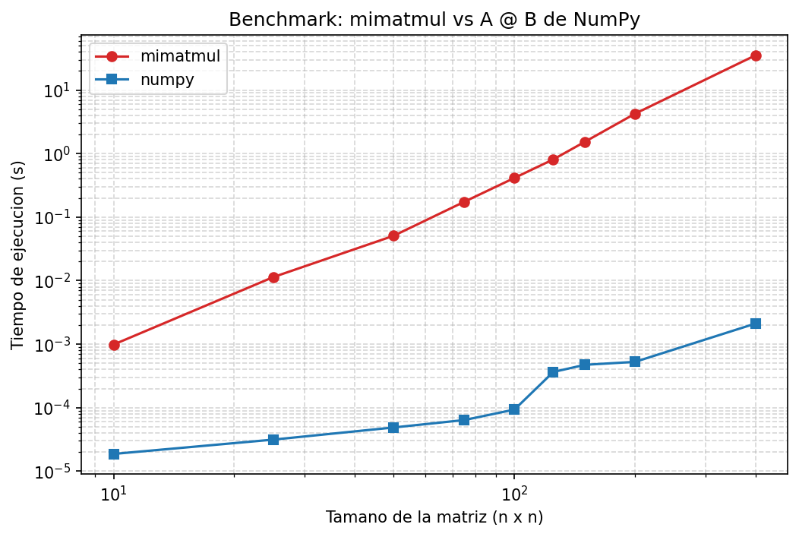

# P0-vergara-eduardo

Proyecto P0 del curso "Metodos computacionales en obras civiles" (Universidad de los Andes).

## Descripcion

El proyecto prepara un ambiente de trabajo reproducible para el curso y presenta
un desarrollo incremental en cuatro partes:

1. `src/system_info.py` recolecta las caracteristicas principales del computador.
2. `src/mimatmul.py` implementa la multiplicacion de matrices con ciclos explicitos de Python.
3. `tests/test_mimatmul.py` verifica automaticamente la funcion con `pytest`.
4. `src/benchmark.py` compara el tiempo de `mimatmul` contra la operacion optimizada `A @ B` de NumPy
   y guarda los resultados en `data/benchmark_results.csv` y `figures/benchmark.png`.

Todo el codigo fue producido con el agente de programacion OpenCode y revisado por el estudiante.

## Instalacion

Requisitos: Python 3.10, Git y una terminal (PowerShell en Windows).

```powershell
# 1. Crear el ambiente virtual
python -m venv .venv

# 2. Activarlo
.venv\Scripts\activate

# 3. Instalar las dependencias
pip install -r requirements.txt
```

## Ejecucion

```powershell
# Informacion del computador (genera data/system_info.json)
python src/system_info.py

# Pruebas automaticas
python -m pytest

# Benchmark (genera data/benchmark_results.csv y figures/benchmark.png)
python src/benchmark.py
```

## Computador

Caracteristicas registradas en `data/system_info.json` (equipo evaluado, 2026-08):

| Dato | Valor |
| --- | --- |
| Sistema operativo | Microsoft Windows 11 Pro (AMD64) |
| Procesador | Intel Core i7-1065G7 @ 1.30 GHz |
| Nucleos | 4 fisicos / 8 logicos |
| Memoria RAM | 15.78 GB total |
| GPU | Intel Iris Plus Graphics y NVIDIA GeForce GTX 1050 con Max-Q |
| Disco principal | 475.7 GB total, 156.5 GB libres |
| Python / NumPy | 3.10.11 / 2.2.6 |

## Resultados



El grafico muestra el tiempo medio por repeticion (escala log-log) para matrices
cuadradas de `n = 10` a `n = 400`. Se miden 3 repeticiones por tamano, precedidas
de una llamada de calentamiento.

Comportamiento observado:

- `mimatmul` crece aproximadamente como `n^3`: de ~0.0005 s en `n=10` a ~35 s en `n=400`
  (al duplicar de 200 a 400, el tiempo se multiplica por ~8).
- NumPy es mucho mas rapido en todo el rango: ~0.002 s en `n=400`, unas
  ~17000 veces mas rapido en el tamano mayor.
- Las repeticiones del mismo caso no son identicas (p. ej. `mimatmul` en `n=125`
  vario entre ~0.95 y ~1.11 s) porque el tiempo depende de la planificacion del
  sistema operativo, el turbo del procesador y la actividad de fondo.

### Observacion de recursos

Durante una ejecucion representativa se midio el uso por nucleo con `psutil`
mientras corria cada metodo (n=150 para `mimatmul`, n=3000 para NumPy):

- `mimatmul` no saturo ningun nucleo: es un ciclo Python monohilo (el GIL impide
  paralelizar), por lo que usa aproximadamente un nucleo logico y deja el resto libre.
- `A @ B` de NumPy saturo los 8 nucleos logicos al ~100%: su biblioteca BLAS
  (OpenBLAS) esta compilada en C/Fortran, usa instrucciones SIMD y paraleliza en
  varios hilos. Por eso es mas rapido: menos interpretacion, operaciones vectorizadas,
  mejor uso de cache y de todos los nucleos.
- La memoria libre bajo ~1.4 GB durante la fase de NumPy (matrices de 3000x3000,
  ~72 MB cada una). Con 15.78 GB de RAM, los tamanos del benchmark deben ser
  pequenos: una matriz de `n=8000` ya ocupa ~512 MB y su producto otra mas, y
  `mimatmul` escala como `n^3`, por lo que es muy facil agotar la memoria o
  congelar el computador.
- La GPU (GTX 1050) aparecio con 0% de uso durante el benchmark: tener una GPU no
  implica que el programa la use; NumPy ejecuta en CPU y solo bibliotecas como
  CuPy/TensorFlow envian operaciones a la GPU de forma explicita.

## Uso de OpenCode

Reflexion sobre el trabajo con el agente (revisar y completar a mano):

- **Que hizo correctamente**: propuso una estructura de repositorio ordenada,
  escribio los tres scripts y las pruebas, y los ejecuto paso a paso; los datos
  de `data/` provienen de ejecuciones reales en este computador.
- **Que tuvo que corregirse**: el primer conteo de nucleos fisicos usaba
  `Win32_ComputerSystem.NumberOfProcessors` (que cuenta sockets) y fue corregido
  con `Win32_Processor.NumberOfCores`; `platform.system()` reportaba "Windows 10"
  y fue corregido para usar el nombre real del sistema operativo; la medicion de
  CPU del proceso no funcionaba con `Get-Counter`/`Get-Process` en este equipo y
  se reemplazo por `psutil`.


## Estructura

```
P0-vergara-eduardo/
├── README.md
├── AGENTS.md
├── requirements.txt
├── conftest.py
├── src/
│   ├── system_info.py
│   ├── mimatmul.py
│   └── benchmark.py
├── tests/
│   └── test_mimatmul.py
├── data/
│   ├── system_info.json
│   └── benchmark_results.csv
└── figures/
    └── benchmark.png
```
